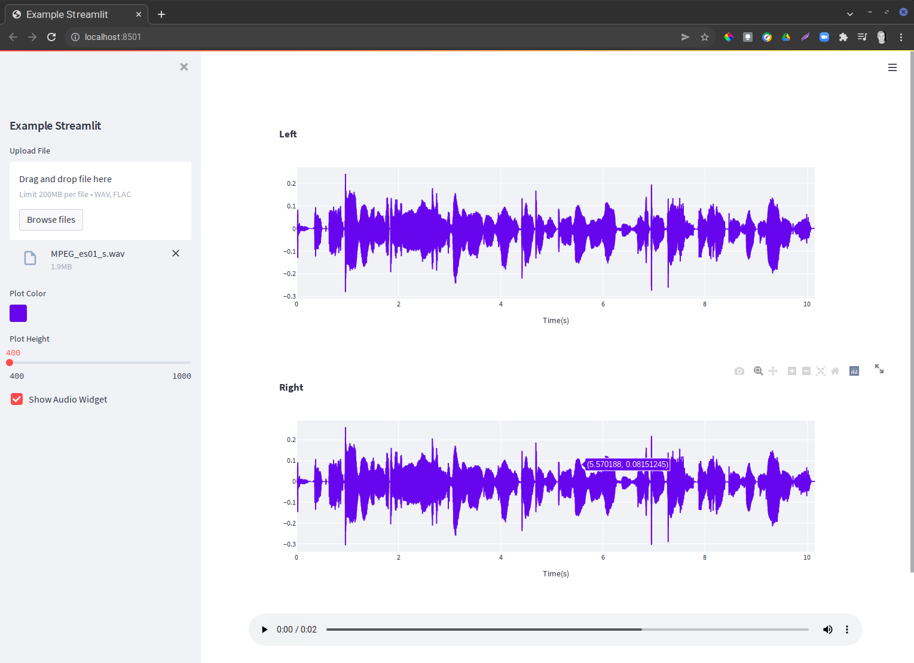

# Example Streamlit Application

I wrote this to understand uploads and session state and to explore
some ideas about seperating the Model and View for Streamlit.

Computations and state are stored in the Model class.  To simplify things,
the Model class uses the streamlit session_state dictionary, allowing easy
access to state variables.

The layout is defined in the view function.

The application itself simply displays the start of the audio waveform for any uploaded
WAV or FLAV file.

